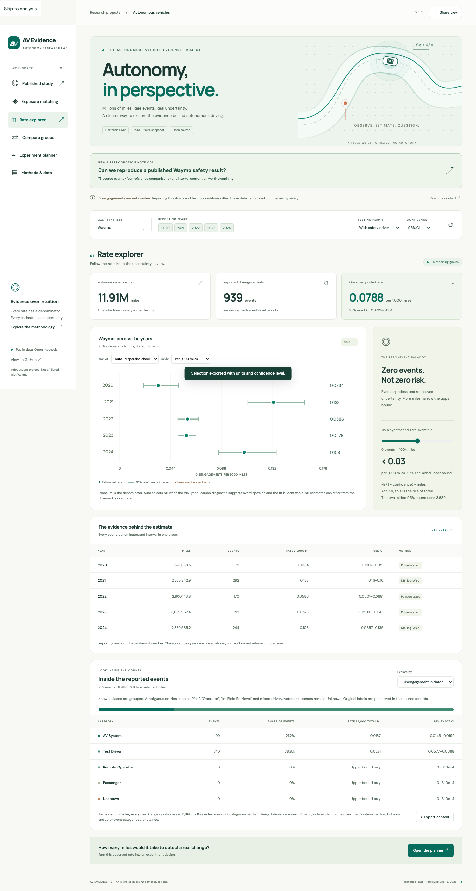
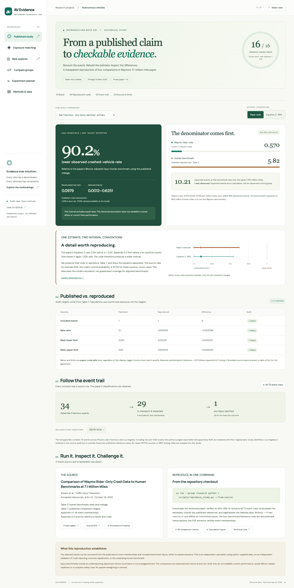
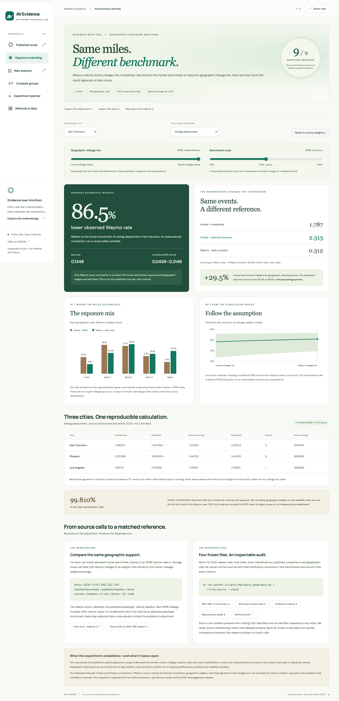

# AV Evidence

**[Open the publication study →](https://vivaran.news/waymo-project/?tab=replication)** ·
[Exposure matching](https://vivaran.news/waymo-project/?tab=geography) ·
[DMV explorer](https://vivaran.news/waymo-project/?tab=rates) · [Source data and audit](data/README.md)

An independent AV evidence project: reproduce selected published Waymo **rider-only
crash comparisons**, explore California DMV **disengagement** rates, and plan the
exposure needed for a hypothetical two-arm experiment. Each study keeps its own
population, outcomes and mileage; crash counts are never joined to DMV testing miles.



## What it does

- **Published study:** recount 73 appendix events from a versioned Waymo paper and
  reproduce four city/outcome reference comparisons. All 16 count/ratio/interval
  checks match within the paper's stated tolerance. Inspect both the paper-code
  and Equation 2 interval conventions, follow event IDs to source pages, and
  download every input and audit result. [Technical note](docs/replication-study.md).
- **Exposure matching:** reconstruct nine geographic human benchmarks across 987 cells
  in San Francisco, Phoenix and Los Angeles. Explore mileage-distribution and benchmark
  sensitivity, conditional count uncertainty, coverage gaps and downloadable provenance.
  Uses the frozen December 2024 cohort with 2022 benchmarks, separate from the publication
  study. [Technical note](docs/geographic-exposure.md).
- **Rate explorer:** manufacturer/year/permit filters, 90/95/99% intervals, selectable
  exact Poisson or Negative Binomial estimation, zero-event upper bounds, and CSV export.
  Inspect initiator, location and cause categories with event shares, exact intervals,
  explicit total-mile denominators and a separate context export.
- **Compare:** exposure-adjusted B/A rate ratios, log-Wald or zero-count exact conditional
  intervals, and exact conditional Poisson p-values.
- **Experiment planner:** editable rates, improvement, power, significance, allocation,
  sidedness and design effect; miles and expected events per arm; live power curve.
- **Methods & data:** formulas, assumptions, source links, cleaning audit and limitations.
- Responsive desktop/mobile interface with shareable filter URLs and a Python/Streamlit companion.

## Data

The publication study freezes **arXiv:2312.12675v3** (October 24, 2024), covering
rider-only operations through October 2023. The primary comparison is San Francisco
any-injury-reported against the paper's adjusted human benchmark. Classifications
and benchmark estimates remain author-supplied; this is a computational reproduction,
not independent adjudication or a reconstruction of the original human databases.

Historical **2020–2024** DMV testing reports, retrieved September 16, 2026 UTC.
This is a versioned snapshot, not a live feed or the latest reporting year.
14 original CSVs yield 22,958 event records and 128 annual manufacturer/year/permit
cells. All annual event totals reconcile with the detailed reports. Driverless testing
is included for 2023–2024 and kept separate from safety-driver testing.

Reporting years run December–November. [Data documentation](data/README.md) records
47 reconstructed annual-mileage cells, 13 flagged date anomalies, and one event on a
zero-mile vehicle. The [manifest](data/source_manifest.json) includes URLs and hashes.
Processed CSV and Parquet files are committed; raw files and secrets are excluded.

## Methods

All rates use exposure. For k events over m miles, the observed rate is k/m.

- **Exact Poisson (Garwood):** `[χ²(α/2, 2k), χ²(1−α/2, 2k+2)] / (2m)`.
  For zero events the lower bound is 0. The two-sided 95% upper bound is 3.689/m;
  the separate one-sided 95% rule-of-three bound is 2.996/m.
- **NB2:** `E[Kᵢ] = mᵢ exp(β)` and `Var(Kᵢ) = μᵢ + αNB μᵢ²`.
  Auto uses VIN-year Pearson dispersion (φ > 1, asymptotic p < .05), at least three
  positive-exposure units and a converged identifiable ML fit. Its interval is log-Wald.
  Invalid fits fall back explicitly to exact Poisson. NB rates may differ from pooled rates.
- **Planner:** `T = φ (zcrit + zpower)² [rA/f + rB/(1−f)] / (rA−rB)²`.
  T is total miles. This is a normal approximation with alternative variance;
  φ is a constant quasi-Poisson design effect, not NB2 dispersion α.

Reference check: baseline 1/1,000 miles, 10% reduction, 80% power, two-sided α=.05,
equal allocation and φ=1 require about **2,982,574 total miles** and 1,491 / 1,342
expected events in A/B. The UI labels expected event counts and approximations.

## Run locally

Requires Python 3.12 (tested), [uv](https://docs.astral.sh/uv/) and Node 22.

```bash
uv sync --locked
uv run streamlit run app.py
# Custom web dashboard: http://localhost:8789/waymo-project/
npm ci
npm run build
npx wrangler dev --port 8789
```

## Verify

```bash
uv run ruff check . && uv run ruff format --check .
uv run pytest -q
uv run python scripts/reproduce_study.py --check
uv run python scripts/reproduce_geography.py --check
npm test
npm run test:browser       # preview must be running; uses installed Chrome locally
node scripts/test_accessibility.js
```

Python tests cover statistical reference values, validation, data reconciliation,
deterministic rebuilds when raw files are present, and Streamlit widget interactions.
JavaScript tests cross-check 63 Poisson intervals, 6 comparisons and 27 planner designs
against SciPy, plus boundary handling and 135 geographic sensitivity scenarios. Browser tests exercise all views, filtering,
zero-event groups, event-context categories, invalid planner inputs, exports, share URLs
and mobile overflow. Context tests reconcile every annual cell and preserve ambiguous labels.
GitHub Actions installs Chromium and runs the core and browser tests on every push.

## Reproduce the publication study

```bash
# Fetch/hash the frozen PDF, verify all 73 event rows and rebuild the study.
uv run --group research python scripts/reproduce_study.py --from-source
# Or rebuild offline from committed event rows and documented benchmark inputs.
uv run python scripts/reproduce_study.py
```

The optional `research` dependency group supplies the PDF parser. The four benchmark
and reference rows are transcribed from the paper; the extractor independently
verifies event memberships. The browser displays Python-generated results.

**Method finding:** the paper's Equation 2 uses 2.5% tails at alpha .05; its Appendix
A.3 code uses 1.25% tails for positive counts. Both are explicitly implemented and
displayed. The code reproduces the published reference cases, while the equation
gives a conventional 95% central interval under the model. Adjusted benchmark
uncertainty limits coverage claims. [Full audit and limitations](docs/replication-study.md).



## Reproduce geographic exposure matching

```bash
uv run python scripts/reproduce_geography.py --from-source --check
```

All nine dynamic benchmarks match within 1e-9 IPMM; nine source event counts match
exactly. The baseline and event labels remain publisher-supplied. Scenario intervals
include only Waymo count uncertainty, not human benchmark or weighting uncertainty.
See the [calculation, coverage gaps and limitations](docs/geographic-exposure.md).



## Rebuild the historical snapshot

```bash
uv run python scripts/download_data.py
uv run python -m av_safety.data
uv run python scripts/export_web.py
uv run python scripts/export_reference.py
npm run build
```

The web export precomputes 533 per-manufacturer year-subset NB fits using statsmodels.
Poisson intervals, comparisons and planning run interactively in the browser. There is
no server-side user data, authentication, database, AI API or analytics tracking.

## Deploy

```bash
npx wrangler deploy --dry-run
npx wrangler deploy
```

`wrangler.jsonc` owns only `/waymo-project` and `/waymo-project/*` on `vivaran.news`.
The app is a static asset Worker; the rest of the existing site is unaffected.
`requirements.txt` also supports installation for the Streamlit companion.

## Limitations and design decisions

Disengagements are **not crashes**, injuries, or standardized safety outcomes. Companies
use different thresholds and operating domains. A lower reported rate does not establish
safer operation. Year-to-year comparisons are observational, not release experiments.
Poisson inference assumes independent, constant-rate events; the comparison test does
not correct overdispersion, confounding or multiple testing. NB cannot remove those
limitations, and repeated VINs across years may remain correlated.
The planner assumes independent arms, known rates, fixed analysis and a transferable
design effect; small expected counts, clustering and sequential monitoring need more work.

The custom web UI and Cloudflare hosting follow the current request; the original Python
statistical core and Streamlit companion remain runnable. The publication reproduction
follows the subsequently requested research expansion and is available in the web UI
and Python CLI. No personal identity or Waymo affiliation is implied.

**Pitch:** “I reproduced selected published AV crash-rate comparisons, exposed an
interval-convention difference, and built an interactive tool to inspect the evidence.”
